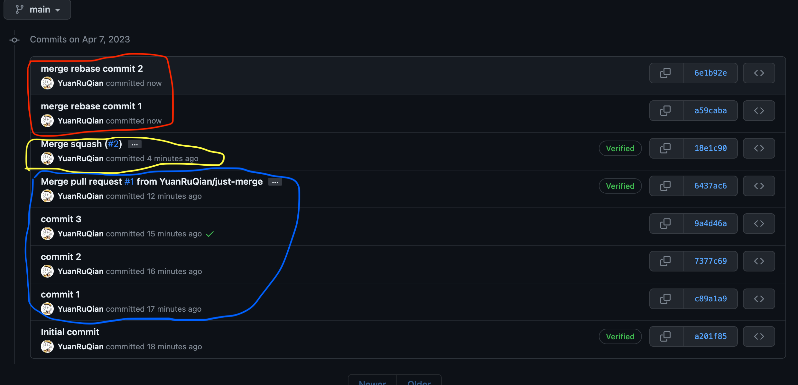

# Plain Merge VS Merge & Squash VS Merge & Rebase

## [Plain Merge](https://github.com/YuanRuQian/git-merge-demo/tree/just-merge)

- Circled in blue
- Retains every commit from the merged branch
- Ends with a merge pull commit which contains all the changes made in each commit

## [Merge & Squash](https://github.com/YuanRuQian/git-merge-demo/tree/merge-squash)

- Circled in yellow
- Merges all the commits into one single commit
- Helps keep the commit history clean and makes it easier to understand the changes made

## [Merge & Rebase](https://github.com/YuanRuQian/git-merge-demo/tree/merge-rebase)

- Circled in red
- Retains every commit from the merged branch
- Does not end with a summary commit

# How to Choose a Merge Strategy

When deciding which merge strategy to use, consider what you want to achieve. If you want to preserve the entire commit history of a branch, a plain merge or merge and rebase may be more appropriate. However, if you want a cleaner and more concise commit history, a merge and squash may be a better option. Ultimately, the choice of merge strategy depends on your specific needs and preferences.